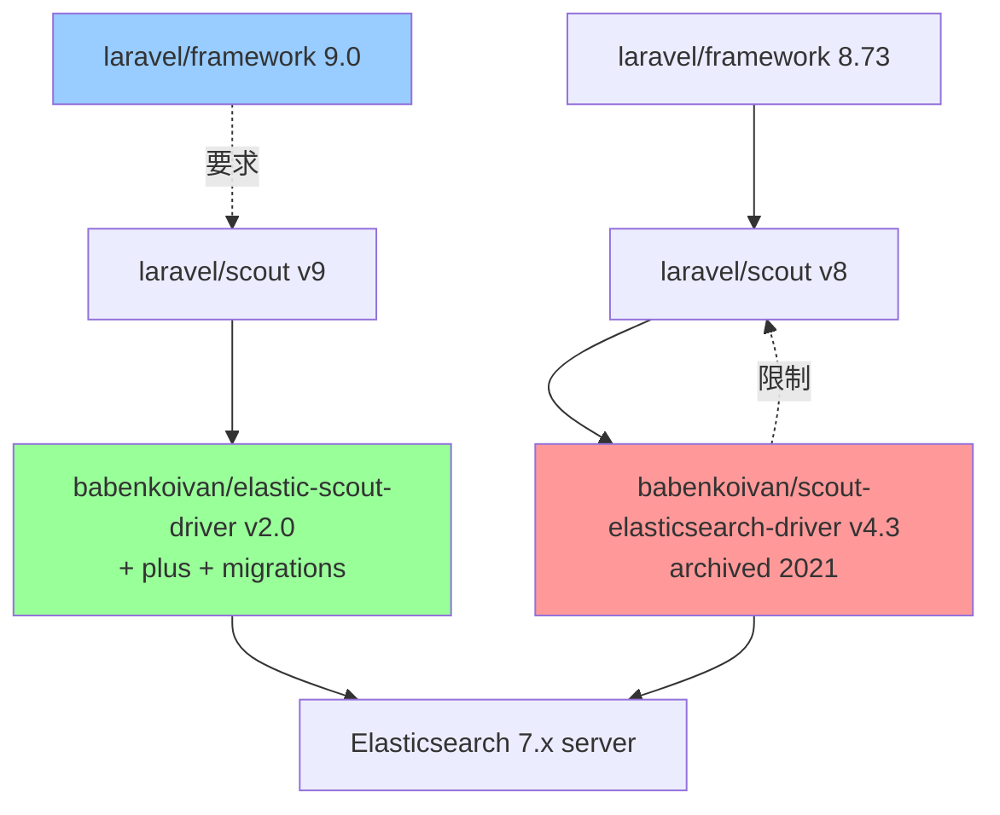

# 🧩 Mermaid 圖

在程式碼區塊標 `mermaid` 語言,就會渲染成流程圖 / 關係圖 / 時序圖等(語法見 mermaid 官網)。

每張圖上方有 5 顆按鈕:

原始碼: 複製 mermaid 原始碼
PNG: 下載 PNG 圖檔
SVG: 複製 `<svg>` 向量標記
Base64: 複製 `` 內嵌碼
複製圖片: 把圖(PNG)複製到剪貼簿

Example: 依賴關係(現況卡點)

